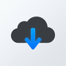

# pyLoad-ng Connector

A sleek, modern browser extension designed to seamlessly integrate your web browsing experience with your **pyLoad-ng** download manager.

## 🚀 Features

-   **One-Click Downloads**: Right-click any link, image, or media file and select "Add to pyLoad" to send it directly to your queue.
-   **Real-time Monitoring**: Monitor your pyLoad server status and download progress directly from the extension popup.
-   **Secure Authentication**: Uses the latest `X-API-Key` authentication for robust security and compatibility with modern pyLoad-ng installations.
-   **Universal Compatibility**: Works with links, images, audio, and video sources.
-   **Native Notifications**: Receive instant feedback when links are successfully added or if an error occurs.

## 🛠️ Installation

### 1. Prerequisites
-   A running instance of [pyLoad-ng](https://github.com/pyload/pyload).
-   Your pyLoad **API Key** (Found in the pyLoad web interface settings).

### 2. Loading the Extension
For development or temporary use in Firefox:
1.  Open Firefox and navigate to `about:debugging#/runtime/this-firefox`.
2.  Click **"Load Temporary Add-on..."**.
3.  Select the `manifest.json` file from this project directory.

### 3. Permanent Installation (Firefox)
Due to Firefox security requirements, extensions must be signed to persist after a restart.
1.  Run the packaging script: `bash package.sh`.
2.  Follow the instructions in [BUILD.md](BUILD.md) to sign and install the extension permanently.

## ⚙️ Configuration

Once installed:
1.  Open the extension **Options** page (accessible via the popup or add-ons manager).
2.  Enter your **Server URL** (e.g., `https://your-pyload-server.com` or `http://192.168.1.100:8000`).
3.  Enter your **API Key**.
4.  Click **Test Connection** to ensure everything is configured correctly.
5.  **Save** your settings.

## 📁 Project Structure

-   `manifest.json`: Extension metadata and permissions.
-   `background.js`: Core logic for API interaction and context menus.
-   `popup.html/js`: The interactive interface for monitoring downloads.
-   `options.html/js`: Configuration interface.
-   `style.css`: Modern, responsive styling for all UI components.
-   `package.sh`: Utility script to package the extension for signing.

## 🛡️ Security

This extension communicates directly with your pyLoad server. It is recommended to use **HTTPS** for your pyLoad server to ensure your API Key and data remain encrypted during transit.

---

*Developed with ❤️ for the pyLoad community.*
